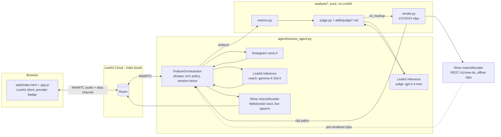

# Podium

A voice-native presentation coach, built for the DataForge x Rime hackathon. You rehearse a
timed talk against slides out loud; Podium listens, measures your delivery, and coaches you
back **by contrast** — it plays your own sentence, then a cleaned version, then the cleaned
version with a deliberate pause, all in the same Rime voice, so the only thing that changes
is delivery.

Full evidence for every claim below (numbers, thresholds, reproduction commands, and honest
limitations) is in [`RIME_EVIDENCE.md`](RIME_EVIDENCE.md). Measured configuration decisions
and rejected alternatives are in [`GATE0.md`](GATE0.md). Frozen cross-module data shapes are
in [`CONTRACTS.md`](CONTRACTS.md).

## What it does

Podium is voice-first: the coach, **Thunder** (named after the Rime speaker in use), talks
you through the whole session, and every button on screen has a spoken equivalent.

1. **Welcome** — press *Start session* (browsers need a gesture before they play audio);
   Thunder introduces himself and offers two ways in: say or type a topic ("a 90-second
   talk on DNS for beginners") and the LLM generates a slide deck, or upload a PDF
   (exported from your slides; PPTX is not supported, see Limitations).
2. **Prep** — Thunder acknowledges the topic with one specific detail about it, then a
   60 s countdown; say "ready" or press *Begin now* to skip it.
3. **Three, two, one, go** — counted aloud with Rime `<NNN>` pause markup, mirrored by an
   on-screen overlay.
4. **Present** — you talk through the slides with a live clock (overtime turns amber); the
   agent listens without interrupting your thinking pauses (the presentation-mode turn
   policy, see below), speaks a T−30 s cue over you without taking your turn, and advances
   slides on your voice or a keypress.
5. **Analyze** — the recording is re-transcribed once through Deepgram's REST endpoint for
   real per-word confidence; code (not the LLM) computes pace, filler rate, pause taxonomy,
   loudness variance, time budget and an **intelligibility** score; the judge LLM scores
   five rubric categories against `skills/judge/*.md`, tags each of up to 3 improvements
   with the curriculum skill it trains (`skills/curriculum/`), and every quote's time span
   is derived by code from the transcript words.
6. **Coach, as a conversation** — the dashboard appears while Thunder summarises the numbers
   in his own words and asks whether to work through the improvements. Each one is
   signposted ("Improvement 2 of 3 — pausing, slide 2") and cued on screen: he plays
   **your own recording** of the sentence (V0), then the cleaned line (V2), then the cleaned
   line with a deliberate pause before the key phrase (V3) — the last two in the same Rime
   voice — and asks you to say it yourself. Your take is recorded, `analysis/practice.py`
   computes fillers before→after, whether the pause landed, and pace, and Thunder phrases
   the verdict. If you interrupt him with a question he answers it and resumes at the step
   he was on, not from the top. Buttons and voice both accept *what I said / cleaner /
   with pauses / another opening / again / slower / why / my turn / next / skip / finish*.
7. **Drill** — up to three words a recogniser was unsure of: you hear your own take, then
   the coach's, say it again, and the confidence is re-measured. This is intelligibility,
   never an accent judgement.
8. **Report** — metrics, judgment, clip playback including your recording slices and
   practice takes, re-record, and *Your path*: the Novice → Speaker → Presenter → Keynote →
   TEDx-ready ladder with per-skill mastery, tracked across sessions per browser.

The coach keeps its thread through a `SessionGraph` (`agent/graph.py`): a timestamped
in-process graph of slides, improvements, clips, attempts, verdicts and your remarks. The
LLM's steering context and the on-screen cues come from the same structure, and a `recap`
tool answers "what have we done so far". Thunder keeps the tone of an energetic friend in
your corner: if you go quiet he checks in with a light line rather than a timeout, and an
off-topic question gets one playful sentence and a steer back. Every number he speaks
comes from code — the coach LLM only phrases facts it is handed. You can interrupt him at
any point or re-record a slide; a revision fence guarantees a stale judgment from a
superseded recording is never spoken (see `RIME_EVIDENCE.md` claim 4).

## Third-party services and exact configuration

Every value below is read from `agent/session_agent.py`, `analysis/render.py`, and
`GATE0.md` — nothing here is a nominal default that isn't what's actually shipped.

| Service | Role | Model / config |
|---|---|---|
| **Rime** — live coach speech | TTS, streaming | Model `mistv3`, speaker `thunder` (flagship, catalog description "a high-energy American male voice, bright and lively"), `lang=eng`, **WebSocket `/ws3`**, `sample_rate=24000` (24 kHz), `pause_between_brackets=true`. LiveKit `rime.TTS` plugin, `use_websocket=True`. The E1/E3 evidence clips were measured on speaker `astra`; pause markup is a Mist v3 model property, and spot checks on the candidate voices (`evidence/voices/`) added +534 ms (`thunder`), +685/+929 ms (`summit`), +395 ms (`wolf`), +697 ms (`hawk`), +755 ms (`bayou`) for a requested `<700>`, so the claims carry over. |
| **Rime** — offline contrastive clips (V2/V3, and V1 as a fallback) | TTS, one-shot | Same model/speaker/lang, **REST `POST https://users.rime.ai/v1/rime-tts`**, `Accept: audio/wav`, `samplingRate=24000`, `pauseBetweenBrackets=true`. Used by `analysis/render.py` and the evidence scripts, never by the live agent. V0 is not Rime at all: it is a slice of the presenter's own recording (`analysis/slice.py`). |
| **Deepgram** — live | STT, streaming | Model `nova-3`, `language=en`, `filler_words=true`, `punctuate=true`, `sample_rate=24000`. `filler_words=true` is load-bearing: a Whisper-class recognizer strips "um"/"uh" and blinds the core filler metric (GATE0.md). |
| **Deepgram** — after each rehearsal | STT, one-shot | `POST https://api.deepgram.com/v1/listen?model=nova-3&language=en&filler_words=true&punctuate=true` on the recorded WAV, same key: the only path that returns **per-word confidence**, which feeds the intelligibility score and the drill. Falls back to the stream's segment confidence if the call fails (`metrics.pronunciation.source`). |
| **LiveKit Inference — coach LLM** | Fast conversational turns | `google/gemma-4-31b-it` |
| **LiveKit Inference — judge LLM** | Strict-JSON scorecard | `openai/gpt-5.4-mini` |
| **LiveKit Cloud** | WebRTC transport, room, turn detection primitives, barge-in | Region **India South** |

Podium therefore speaks through Rime on **two separate paths** with the same voice identity:
a persistent WebSocket connection for anything the presenter hears live, and a REST call per
clip for the pre-rendered contrastive playback — see `RIME_EVIDENCE.md` claim 1 for why the
model was chosen and claim 2 for how the REST path is verified as representative of what the
agent actually plays back.

## Architecture



The offline render path (`analysis/render.py`) is pure and callable without a LiveKit room —
that's what lets `evidence/e1_pause_control.py` and `evidence/e3_delivery_listening.py`
exercise the real contrastive-rendering code from a plain script.

## Running it on Windows

All commands use the project-scoped virtualenv interpreter directly (no `activate` needed).

```powershell
# 1. Agent worker (LiveKit dev mode; needs LIVEKIT_*, RIME_API_KEY, DEEPGRAM_API_KEY in .env)
.venv\Scripts\python.exe -m agent.session_agent dev

# 2. Web client (static files + /token endpoint), in a second terminal
.venv\Scripts\python.exe web\serve.py
# then open http://127.0.0.1:8080/ in a browser, allow microphone access

# 3. Evidence suite (does not need a browser or a running agent worker)
.venv\Scripts\python.exe evidence\run_all.py
```

`agent/gate0_agent.py` is a minimal standalone agent (no coaching logic) kept for smoke-testing
the plugin wiring; it also supports `console` mode for a room-free local mic/speaker check:

```powershell
.venv\Scripts\python.exe agent\gate0_agent.py console
```

## Credential hygiene

- All API keys live in `.env` (`python-dotenv`), which is listed in `.gitignore`; only
  `.env.example` (placeholders) is committed.
- `web/serve.py`'s `/token` endpoint mints a scoped LiveKit `AccessToken` (room join/publish/
  subscribe grants only) server-side and returns the JWT to the browser — `LIVEKIT_API_SECRET`
  itself, and every Rime/Deepgram key, never leaves the server process or reaches client code.
- The LiveKit `rime.TTS` and `deepgram.STT` plugins, and `analysis/render.py`'s REST calls,
  all read their API keys from environment variables inside the agent/evidence processes, not
  from any value sent over the wire.

## Provider visibility

The active speech provider is never silently swapped or hidden:
- The browser UI shows a persistent **provider badge** (`#provider-badge` in `web/index.html`,
  populated by the `"provider"` data-channel message in `web/app.js`) reading
  `rime · mistv3 · thunder` for the whole session.
- Every session's `timeline.jsonl` (`CONTRACTS.md` §4) logs a `provider` event
  (`{"ev":"provider","name":"rime","model":"mistv3","speaker":"thunder"}`) once at session start,
  and `session.json`'s `config` block (`CONTRACTS.md` §1) records the same values plus the STT
  and LLM model IDs actually in use for that session.

## Known limitations

- **PPTX is not supported.** Only PDF upload (parsed client-side with pdf.js) and
  LLM-generated decks. Exporting PPTX to PDF first works.
- **English only** (`lang=eng` on Rime, `language=en` on Deepgram).
- **Pronunciation feedback is a recognizer-confidence proxy, not phonetic assessment.**
  `skills/judge/pronunciation.md` explicitly forbids claiming a term was mispronounced; it may
  only say the recognizer had trouble resolving it (low confidence or a phonetically-close
  substitution) — a correct but unusual pronunciation can still trigger it.
- **No user study.** The only human-listening component (`evidence/e3/listening.csv`,
  V2-vs-V3 "which sounds more confident/clear") is exploratory, small-sample (3-5 people), and
  has not been run — see `RIME_EVIDENCE.md` claim 2.
- **Small evidence samples.** 3-6 fixtures per acceptance test; see `RIME_EVIDENCE.md` for
  exact counts per claim.
- **`timeScaleFactor` is non-linear on Mist v3** (GATE0.md): requesting `1.3` measured a
  **1.67x** actual duration ratio, not 1.3x, so the "say it slower" feature calibrates against
  measured output duration (`analysis/render.py`'s `_calibrated_slower_render`) rather than
  trusting the nominal factor.
- **Interruption stop latency currently misses its target.** Interrupting the coach's spoken
  feedback fires correctly (`session.interrupt()`, no stale judgments spoken, no duplicate
  "heard" marks — measured through a real LiveKit room in `evidence/e2_live_room.py`), but the
  measured P95 stop latency ranges **666–1400 ms across five tuned runs** (1417 ms before
  retuning; P50 595–682 ms) against a ≤300 ms target. See `RIME_EVIDENCE.md` claim 4, Part C, for the full
  before/after numbers and why the measurement itself carries a caveat (barge-in retry
  cascades inflate a few outlier trials).

## Prior art and what's different

The Rime voice-agent catalog already includes "Continuum — Interview Practice", a Q&A agent
with memory. Podium is a different shape of problem: **timed monologue rehearsal graded
against slides**, not conversational Q&A. Specifically:
- Acoustic metrics (pace, pause taxonomy, filler rate, loudness variance) are **computed from
  the audio and STT word timestamps by code** (`analysis/metrics.py`), not inferred or
  estimated by an LLM.
- The coaching mechanism is **contrastive Rime playback** — the same voice speaking the
  as-delivered line, the cleaned line, and the paced line back to back — not a text
  explanation of what to change.
- A **presentation-mode turn policy** (manual turn detection while presenting, switched back
  to VAD once the presenter signals they're done) is required because a monologue has long
  in-context thinking pauses that default endpointing treats as end-of-turn; a Q&A agent
  doesn't face this.

No broader novelty is claimed beyond this specific combination.
