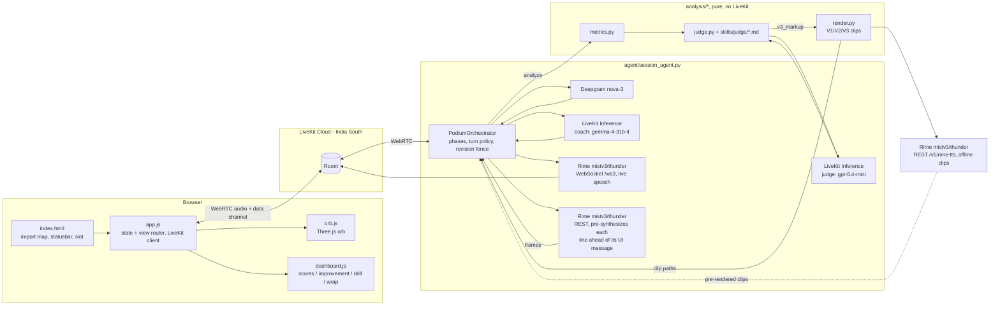

# Podium

A voice-native presentation coach: you rehearse a timed talk out loud against slides, and a
Rime-voiced coach listens over a live duplex call, measures your delivery, and coaches you back
by contrast.


Podium is not a Q&A voice agent with memory. It is built for one specific, harder problem:
**timed monologue rehearsal graded against slides.** You talk for a fixed budget while Podium
listens through Deepgram in real time; every metric it reports — pace, filler rate, pause
taxonomy, loudness variance, intelligibility — is computed in code from the audio and word
timestamps, never guessed by an LLM. Then it coaches by contrast: it plays your own sentence
back, then a cleaned version, then the cleaned version with a deliberate pause, all in the same
Rime voice, so the only thing that changes between clips is delivery, not wording. Built for the
DataForge x Rime hackathon.

Full evidence for every claim below — numbers, thresholds, reproduction commands and honest
limitations — is in [`RIME_EVIDENCE.md`](RIME_EVIDENCE.md). Measured configuration decisions and
rejected alternatives are in [`GATE0.md`](GATE0.md). Frozen cross-module data shapes are in
[`CONTRACTS.md`](CONTRACTS.md).

## Demo

[**Watch the film with sound**](https://github.com/Manishprsd563/podium/releases/download/v1.0.0/podium-demo.mp4) · 4:18

<video src="https://github.com/Manishprsd563/podium/raw/master/docs/demo/podium-demo.mp4" poster="docs/demo/podium-poster.png" controls preload="metadata" playsinline width="100%"></video>

## Quickstart

**Prerequisites**

- Python 3.12.
- A modern Chromium- or Firefox-based browser with microphone access.
- Accounts for [LiveKit Cloud](https://cloud.livekit.io), [Rime](https://rime.ai), and
  [Deepgram](https://console.deepgram.com).
- No separate LLM key: the coach and judge models both run on LiveKit Inference, authenticated
  by your LiveKit credentials.

**Install**

```bash
git clone https://github.com/Manishprsd563/podium.git
cd podium
python -m venv .venv
```

```powershell
# Windows
.venv\Scripts\python.exe -m pip install -r requirements.txt
```

```bash
# macOS / Linux
.venv/bin/python -m pip install -r requirements.txt
```

**Configure**

```bash
cp .env.example .env
```

Fill in the three required credentials:

| Variable(s) | Where to get it |
|---|---|
| `LIVEKIT_URL`, `LIVEKIT_API_KEY`, `LIVEKIT_API_SECRET` | [cloud.livekit.io](https://cloud.livekit.io) → your project → Settings → Keys. Also authenticates the coach/judge LLM calls (LiveKit Inference) — no separate LLM key needed. |
| `RIME_API_KEY` | [rime.ai](https://rime.ai) → dashboard → API keys. |
| `DEEPGRAM_API_KEY` | [console.deepgram.com](https://console.deepgram.com) → API Keys. |

**Run** (two terminals)

```powershell
# Terminal 1 -- agent worker (Windows path shown; macOS/Linux: .venv/bin/python)
.venv\Scripts\python.exe -m agent.session_agent dev
```

```powershell
# Terminal 2 -- static client + /token endpoint
.venv\Scripts\python.exe web\serve.py
```

`web/serve.py` prints the URL it is serving on — open that in your browser
(`http://127.0.0.1:8090/` by default; the port is 8090 rather than the more common 8080
because Docker Desktop's backend already occupies 8080 on the dev machine this was built on).

**First run**

Allow microphone access when the browser asks. Podium greets you by voice as soon as it joins
the room. Say a topic (or upload a PDF of your slides), pick a level and a length when asked,
and Podium generates a three-slide deck. You get 60 seconds of prep, then present against a
live clock, then get a scorecard and spoken, contrastive coaching.

## How a session works

Podium is voice-first: the coach talks you through the whole session, and every button on
screen has a spoken equivalent. Outside `present` the microphone stays muted until you
deliberately take the floor — hold **Space** to talk, double-tap to latch it open, **Escape**
to release. During `present` the microphone is live for the whole take instead; that recording
is the deliverable.

1. **Setup** — the coach introduces itself and offers two ways in: say or type a topic ("a
   five-minute talk on smart cities"), or upload a PDF exported from your slides. A spoken
   topic is captured deterministically — the LLM never gets a free-form setup turn — then
   level and length are asked one at a time, with the same options shown on screen as spoken
   aloud, so voice and buttons take exactly the same path.
2. **Deck** — once topic, level and length are known, a three-slide deck is generated and
   acknowledged with one specific detail about your topic, so you can hear that it read the
   brief rather than filed it.
3. **Prep** — a 60-second countdown; say "ready" or press **Enter** to skip it.
4. **Countdown** — a loading overlay stays up until the active Rime voice has rendered the
   clips, then the browser plays "Three, two, one, begin" and shows each numeral on its
   actual playback rather than on an independent visual timer. Recording and the presentation
   clock start only after the browser confirms the final clip finished. If audio is blocked or
   stalls, the overlay asks you to retry — it never starts your presentation silently.
5. **Present** — the slide and a live clock are on screen, and the clock turns amber in
   overtime. Move between slides with **←** / **→** or by voice ("next slide", "previous
   slide"); press **Enter** or say "I'm done" to end the take. The presentation-mode turn
   policy does not end your turn on an in-monologue thinking pause, and a T−30 s cue is spoken
   over you without taking the floor away.
6. **Analyze** — the recording is re-transcribed once through Deepgram's REST endpoint for
   real per-word confidence. Code, not the LLM, computes pace, filler rate, pause taxonomy,
   loudness variance, time budget and intelligibility. The judge LLM then scores five rubric
   categories against `skills/judge/*.md`, tags each of up to three improvements with the
   curriculum skill it trains, and every quote's time span is derived by code from the
   transcript words.
7. **Coach, as a conversation** — the dashboard appears while the coach summarises the numbers
   in its own words and asks whether to work through the improvements. Each one is signposted
   ("Improvement 2 of 3 — pausing, slide 2") and cued on screen: it plays **your own
   recording** of the sentence, then the cleaned line, then the cleaned line with a deliberate
   pause before the key phrase — the last two in the same Rime voice — and asks you to say it
   yourself. Your take is recorded, `analysis/practice.py` computes fillers before and after,
   whether the pause landed, and pace, and the coach phrases the verdict. Interrupt with a
   question and it answers, then resumes at the step it was on rather than from the top.
8. **Drill** — up to three words the recogniser was unsure of: you hear your own take, then the
   coach's, say it again, and the confidence is re-measured. This is intelligibility, never an
   accent judgement.
9. **Keep practising** — there is no separate report page. Score bars return with a delta
   against the previous revision, and you can practise the existing improvements again, retake
   the whole talk (a new revision, new scorecard, visible delta), or start a new topic — all
   without disconnecting. Repeated practice never double-counts the same revision in progress.

The coach keeps its thread through a `SessionGraph` (`agent/graph.py`): a timestamped
in-process graph of slides, improvements, clips, attempts, verdicts and your own remarks. The
LLM's steering context and the on-screen cues come from that one structure, and a `recap` tool
answers "what have we done so far". Every number it speaks comes from code — the coach LLM only
phrases facts it is handed. A revision fence guarantees that a stale judgment from a superseded
recording is never spoken.

## What is measured, and by what

Source: `analysis/metrics.py`, `CONTRACTS.md` §2.

| Metric | Unit | What it captures |
|---|---|---|
| `wpm` (overall and per slide) | words / minute | Speaking pace |
| `fillers.per_min`, `fillers.count` | count, per minute | Vocal fillers (um, uh, mm, …) and verbal crutches (like, basically, …), counted separately |
| `pauses` | count, seconds | Pause count, longest, mean; split into rhetorical (0.35–1.2 s) and dead air (≥ 2.0 s) |
| `loudness.mean_dbfs`, `loudness.variance_db` | dBFS, dB | Average level and variance |
| `time_budget.used_s` / `over_s` | seconds | How the talk tracked against its budget, overall and per slide |
| `pronunciation.intelligibility` | 0–1 | Share of words the recognizer resolved with confidence ≥ 0.6 |
| `low_confidence_terms` | list | Deck terms the recognizer struggled with, for the drill |

Code computes every one of these numbers; the coach LLM only phrases them into spoken lines. The
judge LLM returns a strict-JSON scorecard (`CONTRACTS.md` §3) — five categories, up to three
improvements, each with a verbatim quote from the transcript (code verifies the substring match
and drops any quote that isn't one).

## The orb, and what it tells you

A Three.js shader orb plus a live caption are the only constant on screen; the panel beneath
them changes with the phase. The orb is not decoration — it is the session's state machine made
visible. Colour and motion for every state live in one table in `web/orb.js`, and
`web/app.js`'s `computeOrbState()` picks the state; transitions are GSAP-tweened over ~600 ms,
never snapped.

| State | Colour | What it means |
|---|---|---|
| `connecting` / `reconnecting` | grey, orbiting ring | not joined yet, or LiveKit is retrying |
| `idle` | teal → periwinkle | connected, floor open, nobody audible |
| `speaking` | teal → periwinkle, faster | the coach's own output level is above threshold |
| `listening` | violet → teal | your microphone level is above threshold |
| `micLive` | green | the push-to-talk floor is yours |
| `waiting` | amber, breathing | the coach is waiting on an answer from you |
| `thinking` | grey, orbiting ring | a line is being synthesized; the coach is deliberately silent |
| `disconnected` | red | was connected and dropped |

The orb's noise shimmer and halo brightness are driven every frame by the smoothed RMS
amplitude of whichever side holds the floor, so the blob visibly reacts to your voice rather
than animating on a loop. If `WebGLRenderer` construction fails, a 2D-canvas fallback renders
the same state table without the shader detail, and the orb recovers from WebGL context loss
instead of freezing.

## Speech-first sequencing

Every UI-affecting agent message — `coach`, `feedback`, `judgment`, `focus`, `progress`, and
the `phase` transitions into coaching — is sent only after the audio for its matching spoken
line already exists. The coach line is pre-synthesized over Rime REST, and only once those
frames are in hand does the message go out over the data channel.

The reason is a specific failure mode: a dashboard that updates before the voice explains it
reads as a lag or, worse, as the numbers and the narration disagreeing. Sequencing the other
way round means the screen and the sentence always land together, and a synthesis failure
degrades into a silent-but-consistent UI rather than a caption describing something that never
got said.

## Voice and provider configuration

Every value below is read from `agent/session_agent.py`, `analysis/render.py`, and
`agent/llm_config.py` — nothing here is a nominal default that isn't what actually ships.

| Role | Service / config |
|---|---|
| Live coach voice | Rime `mistv3`, speaker `thunder`, `lang=eng`, WebSocket `wss://users-ws.rime.ai/ws3`, 24 kHz PCM |
| Coach-line pre-synthesis | Same model/speaker/lang/rate, REST (`use_websocket=False`), synthesized ahead of the matching UI message |
| V1/V2/V3 contrast clips | Same model/speaker/lang, REST `POST https://users.rime.ai/v1/rime-tts`, 24 kHz WAV |
| Live STT | Deepgram `nova-3`, `filler_words=true`, `punctuate=true` — `filler_words=true` is load-bearing: a Whisper-class recognizer strips "um"/"uh" and blinds the filler metric |
| Post-take STT | Deepgram `nova-3` REST re-transcription, the only path with per-word confidence |
| Coach LLM | LiveKit Inference `google/gemma-4-31b-it` — fast conversational turns |
| Judge LLM | LiveKit Inference `openai/gpt-5.4-mini` — strict-JSON scorecard |
| Transport | LiveKit Cloud, region India South |

The active provider is never hidden: the status bar at the bottom of the page always shows the
connection state and a provider badge (for example `rime · mistv3 · thunder`) for the whole
session, and both `timeline.jsonl` and `session.json` log the same values.

## Evidence

Four claims, each preregistered with an acceptance test and measured against the real code
path — including one that misses its target and is published as a miss. Full numbers,
procedures, and limitations are in [`RIME_EVIDENCE.md`](RIME_EVIDENCE.md).

| Claim | Test | Result |
|---|---|---|
| 1. Pause markup is real, measurable, never spoken | 3 fixtures × 2 models, added silence within ±450 ms of a requested 1500 ms | mistv3 3/3 within tolerance (−20/+120/+80 ms); Coda 0/3; markup never spoken on either |
| 2. Contrastive coaching is measurable on the shipped render path | 6 fixtures, V1 filler present / V3 pause ≥ 400 ms longer than V2's longest gap / markup never spoken | 6/6 on all three checks |
| 3. Presentation-mode turn policy never ends a thinking pause | 6 fixtures, 2.0–5.0 s in-monologue pauses, target 0 premature turn ends | 0/6, vs. 6/6 premature ends on the default VAD baseline |
| 4. Interruption stop latency in a live room | P95 stop latency ≤ 300 ms | **Missed** — P95 1400 ms (tuned config), P50 682 ms, against the 300 ms target |

Re-run the full suite with `python evidence/run_all.py`. It spends real Rime/Deepgram API
credit and exits non-zero when a preregistered target (like claim 4's stop latency) is missed.

## Architecture


One duplex call carries everything. Your microphone streams through LiveKit into Deepgram for
words and timestamps; a turn-gated session graph decides when the coach may speak; Rime speaks
it live over a WebSocket at 24 kHz, while the same model renders the contrast clips over REST.
The analysis lane is deliberately separate: it is pure Python with no LiveKit dependency, which
is what makes every number reproducible outside a live room.

<details>
<summary>The same graph as exact module wiring</summary>



</details>

**Repository layout**

| Directory | Contents |
|---|---|
| `agent/` | The LiveKit agent worker — `session_agent.py` (phases, turn policy, revision fence), `graph.py` (`SessionGraph`), `store.py` (session persistence), `llm_config.py` |
| `analysis/` | Pure, LiveKit-free scoring code — metrics, judge, contrastive render, practice verdicts, slicing, pronunciation |
| `web/` | The no-build-step browser client — `index.html`, `app.js`, `orb.js`, `dashboard.js`, and `serve.py` |
| `skills/` | Authored judge rubric and curriculum markdown the coach and judge cite by id |
| `evidence/` | The preregistered acceptance-test scripts behind `RIME_EVIDENCE.md` and their `results.json` output |
| `scripts/` | One-off probes and the local preflight/submission-packaging tools |
| `docs/` | Provider reference notes, the architecture diagram, and the demo film |
| `sessions/` | Per-session recordings, transcripts, and `session.json`/`timeline.jsonl`, written at runtime |

## Configuration reference

| Variable | Required | Default | Read by |
|---|---|---|---|
| `LIVEKIT_URL` | yes | — | Agent worker, `web/serve.py` `/token`, `evidence/e2_duplex.py`, `evidence/e2_live_room.py` |
| `LIVEKIT_API_KEY` | yes | — | Agent worker, `web/serve.py` `/token`, evidence scripts; also authenticates LiveKit Inference |
| `LIVEKIT_API_SECRET` | yes | — | Same as above |
| `RIME_API_KEY` | yes | — | `agent/session_agent.py`, `agent/gate0_agent.py`, `analysis/render.py`, evidence/scripts |
| `RIME_MODEL` | no | `mistv3` | `agent/session_agent.py`, `agent/gate0_agent.py` |
| `RIME_SPEAKER` | no | `thunder` (`summit` in `gate0_agent.py`) | `agent/session_agent.py`, `agent/gate0_agent.py` |
| `DEEPGRAM_API_KEY` | yes | — | Agent worker, evidence/scripts |
| `COACH_MODEL` | no | `google/gemma-4-31b-it` | `agent/llm_config.py` |
| `JUDGE_MODEL` | no | `openai/gpt-5.4-mini` | `agent/llm_config.py` |

## Credential hygiene

- All API keys live in `.env` (`python-dotenv`), which is listed in `.gitignore`; only
  `.env.example` (placeholders) is committed.
- `web/serve.py`'s `/token` endpoint mints a scoped LiveKit `AccessToken` (room join/publish/
  subscribe grants only) server-side and returns the JWT to the browser — `LIVEKIT_API_SECRET`
  itself, and every Rime/Deepgram key, never leaves the server process or reaches client code.
- The LiveKit `rime.TTS` and `deepgram.STT` plugins, and `analysis/render.py`'s REST calls, all
  read their API keys from environment variables inside the agent/evidence processes, not from
  any value sent over the wire.

## Known limitations

- **PPTX is not supported.** Only PDF upload (parsed client-side with pdf.js) and LLM-generated
  decks. Exporting PPTX to PDF first works.
- **English only** (`lang=eng` on Rime, `language=en` on Deepgram).
- **Pronunciation feedback is a recognizer-confidence proxy, not phonetic assessment.** It may
  only say the recognizer had trouble resolving a word — a correct but unusual pronunciation can
  still trigger it.
- **No user study.** The blinded V2-vs-V3 listening sheet (`evidence/e3/listening.csv`) is
  exploratory, small-sample, and has not been run.
- **Small evidence samples.** 3–6 fixtures per acceptance test; see `RIME_EVIDENCE.md` for exact
  counts per claim.
- **`timeScaleFactor` is non-linear on Mist v3.** Requesting `1.3` measured a 1.67x actual
  duration ratio, so the "say it slower" feature calibrates against measured output duration
  rather than trusting the nominal factor.
- **Interruption stop latency currently misses its target.** Interrupting fires correctly (no
  stale judgments spoken, no duplicate "heard" marks), but measured P95 stop latency is well
  above the 300 ms target — see the Evidence section and `RIME_EVIDENCE.md` claim 4.
- **The orb requires WebGL.** A 2D-canvas fallback renders the same state table without the
  shader detail if `WebGLRenderer` construction throws.
- **`prefers-reduced-motion` reduces the motion** rather than playing a slower version of it.

## Troubleshooting

| Symptom | Fix |
|---|---|
| No audio until you click or press a key | Expected: browsers block autoplay until a user gesture; tap anywhere or press any key once. |
| Browser never asks for the microphone | Check the site's microphone permission in your browser's address-bar/site settings and reload. |
| `python web\serve.py` fails to bind | Port 8090 is already in use; stop whatever is on it, or pass a different port as the first argument (`python web/serve.py 8091`) and open that port instead. |
| `/token` returns a 500 / connection fails | Check `LIVEKIT_URL` uses the `wss://` scheme (not `https://`) and that `LIVEKIT_API_KEY`/`LIVEKIT_API_SECRET` are filled in `.env`. |
| Agent worker running, but the browser never shows an agent joining | The worker and the browser's token must point at the same LiveKit project — confirm `LIVEKIT_URL`/`LIVEKIT_API_KEY` match between the two terminals' `.env`. |
| Rime returns 401 | `RIME_API_KEY` is missing or wrong in `.env`; get a fresh key from the Rime dashboard. |
| `/token` returns "LiveKit credentials not configured" | One of `LIVEKIT_URL`/`LIVEKIT_API_KEY`/`LIVEKIT_API_SECRET` is empty in `.env` — `web/serve.py` checks all three before minting a token. |

## Prior art, and what is different here

The Rime voice-agent catalog already includes "Continuum — Interview Practice", a Q&A agent
with memory. Podium is a different shape of problem — **timed monologue rehearsal graded
against slides**, not conversational Q&A — and three consequences follow from that:

- Acoustic metrics (pace, pause taxonomy, filler rate, loudness variance) are **computed from
  the audio and STT word timestamps by code** (`analysis/metrics.py`), not inferred by an LLM.
- The coaching mechanism is **contrastive Rime playback** — the same voice speaking the
  as-delivered line, the cleaned line and the paced line back to back — not a text explanation
  of what to change.
- A **presentation-mode turn policy** is required, because a monologue has long in-context
  thinking pauses that default endpointing treats as end-of-turn. A Q&A agent never faces this.

No broader novelty is claimed beyond this specific combination.

## License and credits

[MIT](LICENSE) — do what you like with it, keep the copyright notice, no warranty.

Built for the DataForge x Rime hackathon. The coaching curriculum and judge rubric under
`skills/curriculum/` and `skills/judge/` are project-authored.

The license covers the code in this repository. It does not grant rights to the third-party
services Podium calls (Rime, Deepgram, LiveKit — each has its own terms), and the browser
client loads Three.js, GSAP, Lenis and livekit-client from a CDN under their own licenses.
