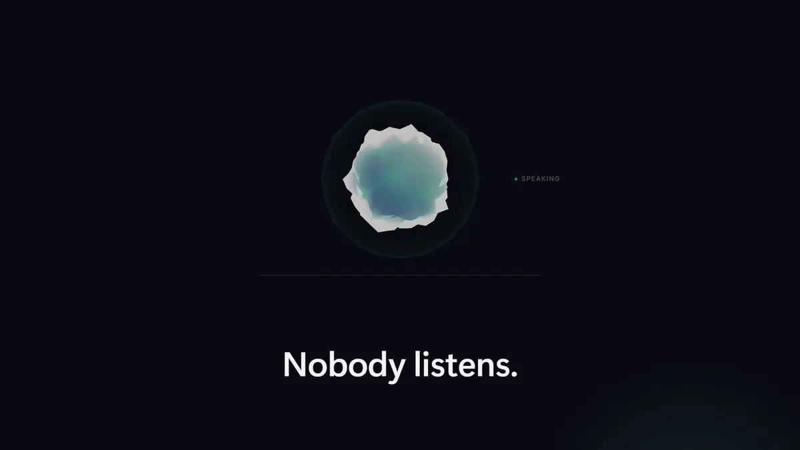
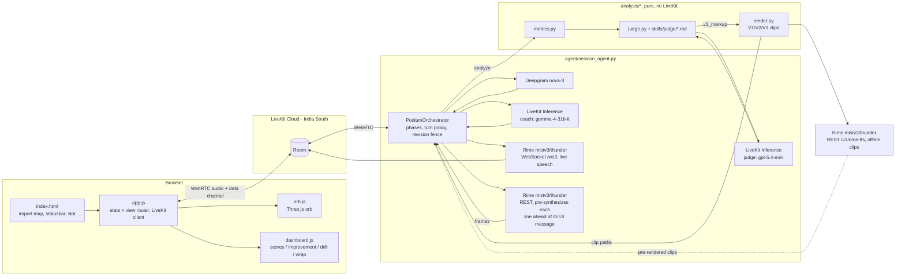

# Podium

A voice-native presentation coach: you rehearse a timed talk out loud against slides, and a
Rime-voiced coach listens over a live duplex call, measures your delivery, and coaches you back
by contrast.


Podium is not a Q&A voice agent with memory. It is built for one specific, harder problem:
**timed monologue rehearsal graded against slides.** You talk for a fixed budget while Podium
listens through Deepgram in real time; every metric it reports — pace, filler rate, pause
taxonomy, loudness variance, intelligibility — is computed in code from the audio and word
timestamps, never guessed by an LLM. Then it coaches by contrast: it plays your own sentence
back, then a cleaned version, then the cleaned version with a deliberate pause, all in the same
Rime voice, so the only thing that changes between clips is delivery, not wording. Built for the
DataForge x Rime hackathon.

## Demo

<!-- Autoplaying animated WebP: GitHub's Markdown sanitiser strips <video> for
     every host except its own attachment CDN, and it serves a raw .mp4 as a
     download rather than a stream. An animated image is the only preview that
     actually plays on a repository front page. -->

[](https://github.com/Manishprsd563/podium/releases/download/v1.0.0/podium-demo.mp4)

**[Watch the full film with sound](https://github.com/Manishprsd563/podium/releases/download/v1.0.0/podium-demo.mp4)** — 4 minutes 18 seconds,
1600x900, 12 MB. Also in the repository at
[`docs/demo/podium-demo.mp4`](docs/demo/podium-demo.mp4), and attached to
[release v1.0.0](https://github.com/Manishprsd563/podium/releases/tag/v1.0.0).

The film is a directed product pitch built on the real Podium browser UI (the actual Three.js
orb from `web/orb.js`, captured live), voiced by three Rime `mistv3` speakers, and grounded in
real measured numbers from this repository (`RIME_EVIDENCE.md`, `sessions/s_20260909_160535/`)
rather than invented statistics.

## Quickstart

**Prerequisites**

- Python 3.12.
- A modern Chromium- or Firefox-based browser with microphone access.
- Accounts for [LiveKit Cloud](https://cloud.livekit.io), [Rime](https://rime.ai), and
  [Deepgram](https://console.deepgram.com).
- No separate LLM key: the coach and judge models both run on LiveKit Inference, authenticated
  by your LiveKit credentials.

**Install**

```bash
git clone https://github.com/Manishprsd563/podium.git
cd podium
python -m venv .venv
```

```powershell
# Windows
.venv\Scripts\python.exe -m pip install -r requirements.txt
```

```bash
# macOS / Linux
.venv/bin/python -m pip install -r requirements.txt
```

**Configure**

```bash
cp .env.example .env
```

Fill in the three required credentials:

| Variable(s) | Where to get it |
|---|---|
| `LIVEKIT_URL`, `LIVEKIT_API_KEY`, `LIVEKIT_API_SECRET` | [cloud.livekit.io](https://cloud.livekit.io) → your project → Settings → Keys. Also authenticates the coach/judge LLM calls (LiveKit Inference) — no separate LLM key needed. |
| `RIME_API_KEY` | [rime.ai](https://rime.ai) → dashboard → API keys. |
| `DEEPGRAM_API_KEY` | [console.deepgram.com](https://console.deepgram.com) → API Keys. |

**Run** (two terminals)

```powershell
# Terminal 1 -- agent worker (Windows path shown; macOS/Linux: .venv/bin/python)
.venv\Scripts\python.exe -m agent.session_agent dev
```

```powershell
# Terminal 2 -- static client + /token endpoint
.venv\Scripts\python.exe web\serve.py
```

`web/serve.py` prints the URL it is serving on — open that in your browser
(`http://127.0.0.1:8090/` by default; the port is 8090 rather than the more common 8080
because Docker Desktop's backend already occupies 8080 on the dev machine this was built on).

**First run**

Allow microphone access when the browser asks. Podium greets you by voice as soon as it joins
the room. Say a topic (or upload a PDF of your slides), pick a level and a length when asked,
and Podium generates a three-slide deck. You get 60 seconds of prep, then present against a
live clock, then get a scorecard and spoken, contrastive coaching.

## How a session works

Outside `present`, the microphone stays muted until you deliberately take the floor: hold
**Space** to talk (double-tap to latch it open, **Escape** to release). During `present` the
microphone is live for the whole take instead — that recording is the deliverable.

1. **Setup** — Podium greets you and asks for a topic or a PDF upload. A spoken topic is
   captured deterministically (the LLM never gets a free-form setup turn), then level and
   length are asked one at a time with the same spoken options shown on screen.
2. **Deck** — once topic, level, and length are known, a three-slide deck is generated and
   acknowledged in one line before prep starts.
3. **Prep** — a 60-second countdown; say "ready" or press **Enter** to skip it.
4. **Countdown** — "Three, two, one, begin," spoken in the active Rime voice; recording starts
   only after the browser confirms the last clip has finished playing.
5. **Present** — the current slide and a live clock are on screen (overtime turns amber). Move
   between slides with **←** / **→** or by voice ("next slide"); press **Enter** (or say "I'm
   done") to end the take. The presentation-mode turn policy does not end your turn on an
   in-monologue thinking pause.
6. **Analyze** — the recording is re-transcribed for per-word confidence, code computes every
   metric, and the judge LLM scores five rubric categories and picks up to three improvements.
7. **Coach** — score bars narrated one at a time, then each improvement played back as your own
   clip, a cleaned version, and a paced version, with a chance to practice it yourself.
8. **Drill** — up to three low-confidence words: hear your take, hear the coach's, say it again,
   get re-measured.
9. **Report / wrap** — score bars again with a delta against the previous revision. From here
   you can practice the existing improvements more, try the whole talk again (a new revision,
   new scorecard, and a visible delta), or start a new topic — all without disconnecting.

## What is measured, and by what

Source: `analysis/metrics.py`, `CONTRACTS.md` §2.

| Metric | Unit | What it captures |
|---|---|---|
| `wpm` (overall and per slide) | words / minute | Speaking pace |
| `fillers.per_min`, `fillers.count` | count, per minute | Vocal fillers (um, uh, mm, …) and verbal crutches (like, basically, …), counted separately |
| `pauses` | count, seconds | Pause count, longest, mean; split into rhetorical (0.35–1.2 s) and dead air (≥ 2.0 s) |
| `loudness.mean_dbfs`, `loudness.variance_db` | dBFS, dB | Average level and variance |
| `time_budget.used_s` / `over_s` | seconds | How the talk tracked against its budget, overall and per slide |
| `pronunciation.intelligibility` | 0–1 | Share of words the recognizer resolved with confidence ≥ 0.6 |
| `low_confidence_terms` | list | Deck terms the recognizer struggled with, for the drill |

Code computes every one of these numbers; the coach LLM only phrases them into spoken lines. The
judge LLM returns a strict-JSON scorecard (`CONTRACTS.md` §3) — five categories, up to three
improvements, each with a verbatim quote from the transcript (code verifies the substring match
and drops any quote that isn't one).

## Voice and provider configuration

Every value below is read from `agent/session_agent.py`, `analysis/render.py`, and
`agent/llm_config.py` — nothing here is a nominal default that isn't what actually ships.

| Role | Service / config |
|---|---|
| Live coach voice | Rime `mistv3`, speaker `thunder`, `lang=eng`, WebSocket `wss://users-ws.rime.ai/ws3`, 24 kHz PCM |
| Coach-line pre-synthesis | Same model/speaker/lang/rate, REST (`use_websocket=False`), synthesized ahead of the matching UI message |
| V1/V2/V3 contrast clips | Same model/speaker/lang, REST `POST https://users.rime.ai/v1/rime-tts`, 24 kHz WAV |
| Live STT | Deepgram `nova-3`, `filler_words=true`, `punctuate=true` — `filler_words=true` is load-bearing: a Whisper-class recognizer strips "um"/"uh" and blinds the filler metric |
| Post-take STT | Deepgram `nova-3` REST re-transcription, the only path with per-word confidence |
| Coach LLM | LiveKit Inference `google/gemma-4-31b-it` — fast conversational turns |
| Judge LLM | LiveKit Inference `openai/gpt-5.4-mini` — strict-JSON scorecard |
| Transport | LiveKit Cloud, region India South |

The active provider is never hidden: the status bar at the bottom of the page always shows the
connection state and a provider badge (for example `rime · mistv3 · thunder`) for the whole
session, and both `timeline.jsonl` and `session.json` log the same values.

## Evidence

Four claims, each preregistered with an acceptance test and measured against the real code
path — including one that misses its target and is published as a miss. Full numbers,
procedures, and limitations are in [`RIME_EVIDENCE.md`](RIME_EVIDENCE.md).

| Claim | Test | Result |
|---|---|---|
| 1. Pause markup is real, measurable, never spoken | 3 fixtures × 2 models, added silence within ±450 ms of a requested 1500 ms | mistv3 3/3 within tolerance (−20/+120/+80 ms); Coda 0/3; markup never spoken on either |
| 2. Contrastive coaching is measurable on the shipped render path | 6 fixtures, V1 filler present / V3 pause ≥ 400 ms longer than V2's longest gap / markup never spoken | 6/6 on all three checks |
| 3. Presentation-mode turn policy never ends a thinking pause | 6 fixtures, 2.0–5.0 s in-monologue pauses, target 0 premature turn ends | 0/6, vs. 6/6 premature ends on the default VAD baseline |
| 4. Interruption stop latency in a live room | P95 stop latency ≤ 300 ms | **Missed** — P95 1400 ms (tuned config), P50 682 ms, against the 300 ms target |

Re-run the full suite with `python evidence/run_all.py`. It spends real Rime/Deepgram API
credit and exits non-zero when a preregistered target (like claim 4's stop latency) is missed.

## Architecture



| Directory | Contents |
|---|---|
| `agent/` | The LiveKit agent worker — `session_agent.py` (phases, turn policy, revision fence), `graph.py` (`SessionGraph`), `store.py` (session persistence), `llm_config.py` |
| `analysis/` | Pure, LiveKit-free scoring code — metrics, judge, contrastive render, practice verdicts, slicing, pronunciation |
| `web/` | The no-build-step browser client — `index.html`, `app.js`, `orb.js`, `dashboard.js`, and `serve.py` |
| `skills/` | Authored judge rubric and curriculum markdown the coach and judge cite by id |
| `evidence/` | The preregistered acceptance-test scripts behind `RIME_EVIDENCE.md` and their `results.json` output |
| `scripts/` | One-off probes and the local preflight/submission-packaging tools |
| `docs/` | Reference docs and the demo video/poster |
| `sessions/` | Per-session recordings, transcripts, and `session.json`/`timeline.jsonl`, written at runtime |

## Configuration reference

| Variable | Required | Default | Read by |
|---|---|---|---|
| `LIVEKIT_URL` | yes | — | Agent worker, `web/serve.py` `/token`, `evidence/e2_duplex.py`, `evidence/e2_live_room.py` |
| `LIVEKIT_API_KEY` | yes | — | Agent worker, `web/serve.py` `/token`, evidence scripts; also authenticates LiveKit Inference |
| `LIVEKIT_API_SECRET` | yes | — | Same as above |
| `RIME_API_KEY` | yes | — | `agent/session_agent.py`, `agent/gate0_agent.py`, `analysis/render.py`, evidence/scripts |
| `RIME_MODEL` | no | `mistv3` | `agent/session_agent.py`, `agent/gate0_agent.py` |
| `RIME_SPEAKER` | no | `thunder` (`summit` in `gate0_agent.py`) | `agent/session_agent.py`, `agent/gate0_agent.py` |
| `DEEPGRAM_API_KEY` | yes | — | Agent worker, evidence/scripts |
| `COACH_MODEL` | no | `google/gemma-4-31b-it` | `agent/llm_config.py` |
| `JUDGE_MODEL` | no | `openai/gpt-5.4-mini` | `agent/llm_config.py` |

## Credential hygiene

- All API keys live in `.env` (`python-dotenv`), which is listed in `.gitignore`; only
  `.env.example` (placeholders) is committed.
- `web/serve.py`'s `/token` endpoint mints a scoped LiveKit `AccessToken` (room join/publish/
  subscribe grants only) server-side and returns the JWT to the browser — `LIVEKIT_API_SECRET`
  itself, and every Rime/Deepgram key, never leaves the server process or reaches client code.
- The LiveKit `rime.TTS` and `deepgram.STT` plugins, and `analysis/render.py`'s REST calls, all
  read their API keys from environment variables inside the agent/evidence processes, not from
  any value sent over the wire.

## Known limitations

- **PPTX is not supported.** Only PDF upload (parsed client-side with pdf.js) and LLM-generated
  decks. Exporting PPTX to PDF first works.
- **English only** (`lang=eng` on Rime, `language=en` on Deepgram).
- **Pronunciation feedback is a recognizer-confidence proxy, not phonetic assessment.** It may
  only say the recognizer had trouble resolving a word — a correct but unusual pronunciation can
  still trigger it.
- **No user study.** The blinded V2-vs-V3 listening sheet (`evidence/e3/listening.csv`) is
  exploratory, small-sample, and has not been run.
- **Small evidence samples.** 3–6 fixtures per acceptance test; see `RIME_EVIDENCE.md` for exact
  counts per claim.
- **`timeScaleFactor` is non-linear on Mist v3.** Requesting `1.3` measured a 1.67x actual
  duration ratio, so the "say it slower" feature calibrates against measured output duration
  rather than trusting the nominal factor.
- **Interruption stop latency currently misses its target.** Interrupting fires correctly (no
  stale judgments spoken, no duplicate "heard" marks), but measured P95 stop latency is well
  above the 300 ms target — see the Evidence section and `RIME_EVIDENCE.md` claim 4.
- **The orb requires WebGL.** A 2D-canvas fallback renders the same state table without the
  shader detail if `WebGLRenderer` construction throws.
- **`prefers-reduced-motion` reduces the motion** rather than playing a slower version of it.

## Troubleshooting

| Symptom | Fix |
|---|---|
| No audio until you click or press a key | Expected: browsers block autoplay until a user gesture; tap anywhere or press any key once. |
| Browser never asks for the microphone | Check the site's microphone permission in your browser's address-bar/site settings and reload. |
| `python web\serve.py` fails to bind | Port 8090 is already in use; stop whatever is on it, or pass a different port as the first argument (`python web/serve.py 8091`) and open that port instead. |
| `/token` returns a 500 / connection fails | Check `LIVEKIT_URL` uses the `wss://` scheme (not `https://`) and that `LIVEKIT_API_KEY`/`LIVEKIT_API_SECRET` are filled in `.env`. |
| Agent worker running, but the browser never shows an agent joining | The worker and the browser's token must point at the same LiveKit project — confirm `LIVEKIT_URL`/`LIVEKIT_API_KEY` match between the two terminals' `.env`. |
| Rime returns 401 | `RIME_API_KEY` is missing or wrong in `.env`; get a fresh key from the Rime dashboard. |
| `/token` returns "LiveKit credentials not configured" | One of `LIVEKIT_URL`/`LIVEKIT_API_KEY`/`LIVEKIT_API_SECRET` is empty in `.env` — `web/serve.py` checks all three before minting a token. |

## License and credits

Built for the DataForge x Rime hackathon. The coaching curriculum and rubric files under
`skills/curriculum/` and `skills/judge/` are project-authored. This repository does not yet
declare a license.
