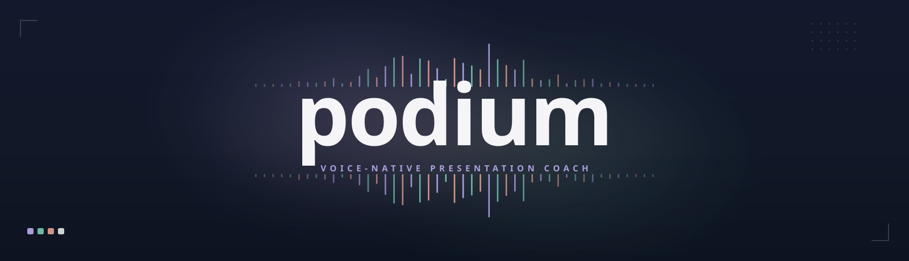
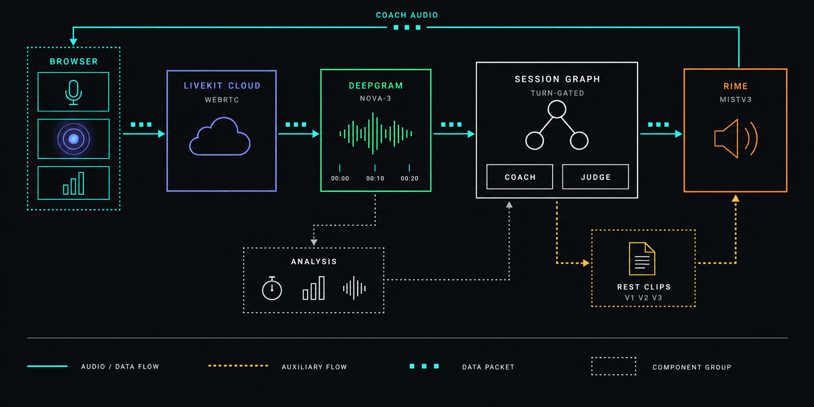

<p align="center">
  
</p>

<p align="center">
  <em>Rehearse out loud. Hear what to improve. Try again.</em>
</p>

<p align="center">
  
  
  
  
</p>

<p align="center">
  <a href="#demo">Demo</a> ·
  <a href="#highlights">Highlights</a> ·
  <a href="#quickstart">Quickstart</a> ·
  <a href="#architecture">Architecture</a> ·
  <a href="#engineering-docs">Docs</a>
</p>

Podium is a voice-native presentation coach built for the DataForge x Rime hackathon. You
rehearse a timed talk out loud against your slides while it listens live, scoring pace, fillers,
pauses, loudness and intelligibility straight from the audio. It then coaches you by contrast: hear your recorded delivery alongside a revised version spoken by Rime. 

With 10+ coaching skills, slide-aware feedback and a session-graph architecture
that tracks each attempt, Podium helps you turn a first rehearsal into a clearer, more
confident, stage-ready presentation.

https://github.com/user-attachments/assets/47fd7337-74b1-4757-b2fa-c5318033535d

## Highlights

- **Timed slide rehearsal.** Talk against your own slides on a live clock, with prep time and a
  deck generated from your topic or an uploaded PDF.
- **Delivery metrics from the audio.** Pace, filler rate, pause taxonomy, loudness variance and
  intelligibility are computed in code from your speech, not estimated by an LLM.
- **Hear the before and after.** Every improvement plays your original line next to a cleaned,
  Rime-voiced rewrite, so you hear the difference instead of reading about it.
- **Focused drills, not a wall of notes.** Up to three improvements and up to three unclear
  words become short spoken practice reps you repeat and get re-scored on.
- **Tracks your progress.** A session graph connects slides, attempts and feedback across
  retakes, so you can see what improved during the session.

## Quickstart

**Prerequisites**

- Python 3.12.
- A modern Chromium- or Firefox-based browser with microphone access.
- Accounts for [LiveKit Cloud](https://cloud.livekit.io), [Rime](https://rime.ai), and
  [Deepgram](https://console.deepgram.com).

**Install**

```bash
git clone https://github.com/Manishprsd563/podium.git
cd podium
python -m venv .venv
```

```powershell
# Windows
.venv\Scripts\python.exe -m pip install -r requirements.txt
```

```bash
# macOS / Linux
.venv/bin/python -m pip install -r requirements.txt
```

**Configure**

```bash
cp .env.example .env
```

Add your provider credentials to `.env`:

| Variable(s) | Where to get it |
|---|---|
| `LIVEKIT_URL`, `LIVEKIT_API_KEY`, `LIVEKIT_API_SECRET` | [cloud.livekit.io](https://cloud.livekit.io) → your project → Settings → Keys. Also authenticates the coach/judge LLM calls (LiveKit Inference) — no separate LLM key needed. |
| `RIME_API_KEY` | [rime.ai](https://rime.ai) → dashboard → API keys. |
| `DEEPGRAM_API_KEY` | [console.deepgram.com](https://console.deepgram.com) → API Keys. |

**Run** (two terminals)

```powershell
# Terminal 1 -- agent worker (Windows path shown; macOS/Linux: .venv/bin/python)
.venv\Scripts\python.exe -m agent.session_agent dev
```

```powershell
# Terminal 2 -- static client + /token endpoint
.venv\Scripts\python.exe web/serve.py
```

`web/serve.py` prints the URL it is serving (`http://127.0.0.1:8090/` by default). Open it in
your browser, allow microphone access, and say a topic or upload a PDF of your slides — Podium
generates a three-slide deck, gives you 60 seconds of prep, then runs the timed presentation,
scorecard, and spoken contrastive coaching.

## Architecture



One duplex call carries everything: your microphone streams through LiveKit into Deepgram for
words and timestamps, a turn-gated session graph decides when the coach may speak, and Rime
speaks it live over a WebSocket while rendering contrast clips over REST. The analysis lane is
deliberately separate — pure Python with no LiveKit dependency — so every number is reproducible
outside a live room. Exact module wiring and frozen data shapes are in
[`CONTRACTS.md`](CONTRACTS.md).

## Engineering docs

- [`RIME_EVIDENCE.md`](RIME_EVIDENCE.md) — the four preregistered claims, acceptance tests, and
  measured results, reproducible with `python evidence/run_all.py`.
- [`GATE0.md`](GATE0.md) — measured configuration decisions and rejected alternatives.
- [`CONTRACTS.md`](CONTRACTS.md) — frozen cross-module data shapes and exact module wiring.

One measured limitation: interruption stop latency currently misses its target — P95 1400 ms
against a 300 ms goal. See `RIME_EVIDENCE.md` claim 4 for the full numbers.

## License

[MIT](LICENSE) © 2026 Manish Prasad.
