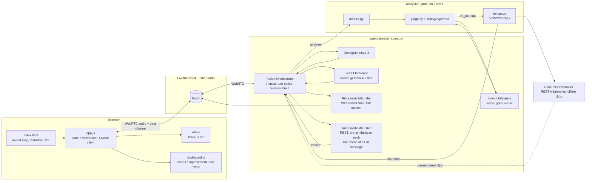

[← Back to project README](../README.md)

# Podium — the full guide

*Rehearse out loud. Hear what to improve. Try again.*

This is the detailed reference for Podium: how a session actually works, what gets measured
and by what, how the voice and UI stay in sync, the evidence behind the hard claims, and the
full configuration and troubleshooting reference. The short project README stays focused on
"what is this and how do I run it"; this guide is where the mechanism and the numbers live.

## Overview

Podium is a voice-native presentation coach: you rehearse a timed talk out loud against
slides, and a Rime-voiced coach listens over a live duplex call, measures your delivery, and
coaches you back by contrast.

Podium is built for one job: **timed monologue rehearsal graded against slides.** You talk for
a fixed budget while Podium listens through Deepgram in real time. Every metric it reports —
pace, filler rate, pause taxonomy, loudness variance, intelligibility — is computed in code from
the audio and word timestamps. A judge LLM then scores the talk against the rubric files in
`skills/judge/`: it reads the transcript for opening, structure, clarity and connection to the
slide on screen, and it reads the measured numbers — never re-estimating them — for delivery and
intelligibility. Coaching works by contrast: you hear your own recording of a line, then the same
point rewritten and spoken by Rime with cleaned-up wording, then that cleaned wording again with a
deliberate pause before the key phrase. The two Rime clips share voice and words, so delivery is
the only thing that changes between them. Built for the DataForge x Rime hackathon.

- **Timed slide rehearsal.** Talk against your own slides on a live clock, with prep time and a
  deck generated from your topic or an uploaded PDF.
- **Measured delivery, judged content.** Pace, filler rate, pause taxonomy, loudness variance and
  intelligibility are computed in code from your speech, never re-estimated by an LLM. A judge
  LLM then scores the talk against six rubric skills — opening and structure, clarity, connection
  to the slide on screen, and how the measured numbers sit against the pace and pause bands — and
  ties each improvement to one of ten curriculum skills.
- **Hear the before and after.** Every improvement plays your own recording next to a cleaned,
  Rime-voiced rewrite, so you hear the difference instead of reading about it.
- **Focused drills, not a wall of notes.** Up to three improvements and up to three unclear
  words become short spoken practice reps you repeat and get re-scored on.
- **Tracks your progress.** A session graph connects slides, attempts and feedback within the
  current session, and a separate, smaller mechanism tracks a mastery level across visits — see
  [Session Walkthrough](#session-walkthrough) for how those two are different.

The numbers, thresholds, reproduction commands and known limitations behind the claims in this
guide are in [`../RIME_EVIDENCE.md`](../RIME_EVIDENCE.md). Measured
configuration decisions and rejected alternatives are in [`../GATE0.md`](../GATE0.md). Frozen
cross-module data shapes are in [`../CONTRACTS.md`](../CONTRACTS.md). The primary-source
provider notes this integration was built against sit alongside this guide, in
[`rime-api.md`](rime-api.md) and [`livekit-agents.md`](livekit-agents.md).

## Table of contents

- [Overview](#overview)
- [Demo](#demo)
- [Setup](#setup)
  - [Prerequisites](#prerequisites)
  - [Install](#install)
  - [Configure](#configure)
  - [Run](#run)
  - [First run](#first-run)
- [Session walkthrough](#session-walkthrough)
- [What gets measured, and how](#what-gets-measured-and-how)
- [The orb: session state at a glance](#the-orb-session-state-at-a-glance)
- [Speech-first sequencing](#speech-first-sequencing)
- [Providers and configuration](#providers-and-configuration)
- [Evidence](#evidence)
- [Architecture](#architecture)
  - [Repository layout](#repository-layout)
- [Configuration reference](#configuration-reference)
- [Credential hygiene](#credential-hygiene)
- [Known limitations](#known-limitations)
- [Troubleshooting](#troubleshooting)
- [Prior art: Continuum and what Podium does differently](#prior-art-continuum-and-what-podium-does-differently)
- [License and credits](#license-and-credits)

## Demo

The demo film is embedded at the top of the [project README](../README.md).

## Setup

### Prerequisites

- Python 3.12.
- A modern Chromium- or Firefox-based browser with microphone access.
- Accounts for [LiveKit Cloud](https://cloud.livekit.io), [Rime](https://rime.ai), and
  [Deepgram](https://console.deepgram.com).
- No separate LLM key: the coach and judge models both run on LiveKit Inference, authenticated
  by your LiveKit credentials.

### Install

```bash
git clone https://github.com/Manishprsd563/podium.git
cd podium
python -m venv .venv
```

```powershell
# Windows
.venv\Scripts\python.exe -m pip install -r requirements.txt
```

```bash
# macOS / Linux
.venv/bin/python -m pip install -r requirements.txt
```

### Configure

```bash
cp .env.example .env
```

Fill in the three required credentials:

|Variable(s)|Where to get it|
|---|---|
|`LIVEKIT_URL`, `LIVEKIT_API_KEY`, `LIVEKIT_API_SECRET`|[cloud.livekit.io](https://cloud.livekit.io) → your project → Settings → Keys. Also authenticates the coach/judge LLM calls (LiveKit Inference) — no separate LLM key needed.|
|`RIME_API_KEY`|[rime.ai](https://rime.ai) → dashboard → API keys.|
|`DEEPGRAM_API_KEY`|[console.deepgram.com](https://console.deepgram.com) → API Keys.|

### Run

Two terminals: one for the agent worker, one for the static client and token endpoint.

```powershell
# Terminal 1 -- agent worker (Windows)
.venv\Scripts\python.exe -m agent.session_agent dev
```

```bash
# Terminal 1 -- agent worker (macOS / Linux)
.venv/bin/python -m agent.session_agent dev
```

```powershell
# Terminal 2 -- static client + /token endpoint (Windows)
.venv\Scripts\python.exe web\serve.py
```

```bash
# Terminal 2 -- static client + /token endpoint (macOS / Linux)
.venv/bin/python web/serve.py
```

`web/serve.py` prints the URL it is serving on — open that in your browser
(`http://127.0.0.1:8090/` by default; the port is 8090 rather than the more common 8080
because Docker Desktop's backend already occupies 8080 on the dev machine this was built on).
Pass a different port as the first argument (`web/serve.py 8091`) if 8090 is also taken.

### First run

Allow microphone access when the browser asks. Podium greets you by voice as soon as it joins
the room. Say a topic (or upload a PDF of your slides), pick a level and a length when asked,
and Podium generates a three-slide deck. You get 60 seconds of prep, then present against a
live clock, then get a scorecard and spoken, contrastive coaching.

## Session walkthrough

Podium is voice-first: the coach talks you through the whole session, and every button on
screen has a spoken equivalent. Outside `present` the microphone stays muted until you
deliberately take the floor — hold **Space** to talk, double-tap within 350 ms to latch it
open, **Escape** to release. During `present` the microphone is live for the whole take
instead; that recording is the deliverable.

1. **Setup** — the coach introduces itself and offers two ways in: say or type a topic ("a
   five-minute talk on smart cities"), or upload a PDF exported from your slides. A spoken
   topic is captured deterministically — the LLM never gets a free-form setup turn — then
   level and length are asked one at a time, with the same options shown on screen as spoken
   aloud, so voice and buttons take exactly the same path.
2. **Deck** — once topic, level and length are known, a three-slide deck is generated and
   acknowledged with one specific detail about your topic, so you can hear that it read the
   brief rather than filed it.
3. **Prep** — a 60-second countdown; say "ready" or press **Enter** to skip it.
4. **Countdown** — a loading overlay stays up until the active Rime voice has rendered the
   clips, then the browser plays "Three, two, one, begin" and shows each numeral on its
   actual playback rather than on an independent visual timer. Recording and the presentation
   clock start only after the browser confirms the final clip finished. If audio is blocked or
   stalls, the overlay asks you to retry — it never starts your presentation silently.
5. **Present** — the slide and a live clock are on screen, and the clock turns amber in
   overtime. Move between slides with **←** / **→** or by voice ("next slide", "previous
   slide"); press **Enter** or say "I'm done" to end the take. The presentation-mode turn
   policy does not end your turn on an in-monologue thinking pause, and a cue is spoken over
   you 30 seconds before your time budget runs out without taking the floor away.
6. **Analyze** — the recording is re-transcribed once through Deepgram's REST endpoint for
   real per-word confidence. Code, not the LLM, computes pace, filler rate, pause taxonomy,
   loudness variance, time budget and intelligibility. The judge LLM then scores five rubric
   categories against `skills/judge/*.md`, tags each of up to three improvements with the
   curriculum skill it trains, and every quote's time span is derived by code from the
   transcript words.
7. **Coach, as a conversation** — the dashboard appears while the coach summarises the numbers
   in its own words and asks whether to work through the improvements. Each one is signposted
   ("Improvement 2 of 3 — pausing, slide 2") and cued on screen: it plays **your own
   recording** of the line first — sliced straight out of your actual take, never a
   synthesized stand-in — then that same point rewritten and rendered by Rime with cleaned-up
   wording, then that identical cleaned wording rendered again with a deliberate pause before
   the key phrase. The last two clips share both the Rime voice and the exact wording, so
   delivery is the only thing that changes between them; what changes between your line and
   the coached ones is the wording as well as the delivery. Interrupt with a question and it
   answers, then resumes at the step it was on rather than from the top.
8. **Drill** — up to three words the recogniser was unsure of: you hear your own take, then the
   coach's, say it again, and the confidence is re-measured. This is intelligibility, never an
   accent judgement.
9. **Keep practising** — there is no separate report page. Score bars return with a delta
   against the previous revision, and you can practise the existing improvements again, retake
   the whole talk (a new revision, new scorecard, visible delta), or start a new topic — all
   without disconnecting. Repeated practice never double-counts the same revision in progress.

The coach keeps its thread through a `SessionGraph` (`agent/graph.py`): a timestamped,
in-process graph of slides, improvements, clips, attempts, verdicts and your own remarks, built
fresh for the current room connection and snapshotted into that session's `session.json` when
it ends. It is not shared with any other session — the LLM's steering context and the on-screen
cues all come from this one structure, and a `recap` tool answers "what have we done so far" by
reading it. Every number the coach speaks comes from code; the coach LLM only phrases facts it
is handed. A revision fence guarantees that a stale judgment from a superseded recording is
never spoken.

A separate, smaller mechanism does carry across visits. `agent/graph.py`'s `Progress` class
persists mastery per browser to `sessions/progress/<client_id>.json`, keyed by a client id the
browser keeps in `localStorage`. After a scored take, it folds that take's rubric scores, the
improvements you worked through, and your practice verdicts into a mastery average for each of
the ten curriculum skills, and reports a level — Novice, Speaker, Presenter, Keynote, or
TEDx-ready — plus a next-focus skill back to the coach, which speaks it at the wrap. That is the
only state that outlives a single session; the session graph itself starts empty every time.

## What gets measured, and how

Three different things get produced during a session, and only one of them is free-form LLM
prose:

- **Metrics** (`analysis/metrics.py`) are pure code: given the transcript's per-word
  timestamps and the raw audio, this module computes pace, fillers, pauses, loudness and time
  budget with no model call anywhere in the path.
- **The judgment** (`analysis/judge.py`) is an LLM call, but a constrained one: code clamps
  every score into 1–5, verifies each improvement's quote is a verbatim substring of the
  transcript (dropping any that is not), computes the quote's time span itself from the
  transcript words rather than trusting the model's own span, and validates the cited skill
  against the fixed ten-item curriculum list, falling back by rubric category when the model's
  choice is not one of them.
- **The coach's speech** is the only place an LLM writes free text, and even there its job is
  to phrase numbers and quotes it has already been handed, not invent them.

Source: `analysis/metrics.py`, `CONTRACTS.md` §2.

|Metric|Unit|What it captures|
|---|---|---|
|`wpm` (overall and per slide)|words / minute|Speaking pace; the metrics block also carries total word count and duration|
|`fillers.per_min`, `fillers.count`|count, per minute|Vocal fillers (`um, uh, mm, hmm, mhm, er, ah`) and verbal crutches (`like, you know, basically, actually, sort of, kind of, i mean, right`), counted and reported separately|
|`pauses`|count, seconds|Pause count, longest, mean; a gap counts once it reaches 0.35 s, and splits into rhetorical (0.35–1.2 s) and dead air (≥ 2.0 s)|
|`loudness.mean_dbfs`, `loudness.variance_db`|dBFS, dB|Average level and variance|
|`time_budget.used_s` / `over_s`|seconds|How the talk tracked against its budget, overall and per slide|
|`pronunciation.intelligibility`|0–1|`1 − (words below 0.6 confidence) / total words` — the share of words Deepgram resolved confidently|
|`low_confidence_terms`|list|Deck terms the recognizer struggled with, for the drill|

The judge returns five scored categories — `delivery`, `clarity`, `structure`,
`slide_connection`, `pronunciation` — a one-or-two-sentence summary, and up to three
improvements, each carrying a verbatim quote, a cleaned rewrite (`v2_text`), a paced rewrite
with pause markup (`v3_markup`), an alternative opening, and the curriculum skill it trains.
`skills/judge/` holds a sixth file, `feedback-style.md`, which is not a scored category — it is
style guidance folded into the same prompt so the judge's tone stays consistent. Drill words
are pulled from the pronunciation block, up to three, deck terms first.

## The orb: session state at a glance

A Three.js shader orb plus a live caption are the only constant on screen; the panel beneath
them changes with the phase. The orb is the session's state machine made visible.
`web/app.js`'s `computeOrbState()` picks the state every frame from connection status,
who currently holds the floor, and smoothed mic/output levels; `web/orb.js` owns the colour
table and tweens every transition over ~600 ms with a `power2.out` ease, never snapping.

Nine state keys map onto the eight rows below — `connecting` and `reconnecting` render
identically, so the table merges them:

|State|Colour|What it means|
|---|---|---|
|`connecting` / `reconnecting`|grey, orbiting ring|not joined yet, or LiveKit is retrying|
|`idle`|teal → violet|connected, floor open, nobody audible|
|`speaking`|teal → violet, faster|the coach's own output level is above threshold|
|`listening`|violet → teal|your microphone level is above threshold|
|`micLive`|green|the push-to-talk floor is yours|
|`waiting`|amber, breathing|the coach is waiting on an answer from you|
|`thinking`|grey, orbiting ring|a line is being synthesized; the coach is deliberately silent|
|`disconnected`|red|was connected and dropped|

The orbiting ring shows only while the coach is preparing something
(`connecting`/`reconnecting`/`thinking`); `waiting` is the one state with its own breathing
animation. The orb's noise shimmer and halo brightness are driven every frame by the smoothed
RMS amplitude of whichever side holds the floor — `speaking` tracks the agent, `micLive` tracks
you — so the blob visibly reacts to your voice rather than animating on a loop.

If `WebGLRenderer` construction throws, a 2D-canvas fallback renders the same state table
without the shader detail; canvas contexts are not lost the way WebGL contexts are, so that
path skips context-recovery handling entirely. The WebGL path needs it: a lost GPU context
(driver reset, GPU switch, a tab waking from sleep) would otherwise leave three.js calling
`renderer.render()` into a dead context every frame until the page reloads, so the orb listens
for `webglcontextlost` / `webglcontextrestored` and stops or resumes its own render loop around
the event instead of freezing.

## Speech-first sequencing

Every UI-affecting agent message — `coach`, `feedback`, `judgment`, `focus`, `progress`, and
the `phase` transitions into coaching — is sent only after the audio for its matching spoken
line already exists. The coach line is pre-synthesized over Rime REST while the agent sends
`attention: thinking`, and only once those frames are in hand does the message go out over the
data channel; measured over a full live session, audio starts within about 0.4 s of the message
being ready, 0.25 s median. `attention: waiting` for the setup form is the one deliberate
exception: it is sent only after the greeting or new-talk prompt has finished playing out, so
the form appears when the coach stops speaking rather than mid-sentence.

The reason is a specific failure mode: a dashboard that updates before the voice explains it
reads as a lag or, worse, as the numbers and the narration disagreeing. Sequencing the other
way round means the screen and the sentence always land together, and a synthesis failure
degrades into a silent-but-consistent UI rather than a caption describing something that never
got said.

## Providers and configuration

Every value below is read from `agent/session_agent.py`, `analysis/render.py`, and
`agent/llm_config.py` — nothing here is a nominal default that is not what actually ships.

|Role|Service / config|
|---|---|
|Live coach voice|Rime `mistv3`, speaker `thunder`, `lang=eng`, WebSocket `wss://users-ws.rime.ai/ws3`, 24 kHz PCM|
|Coach-line pre-synthesis|Same model/speaker/lang/rate, REST (`use_websocket=False`), synthesized ahead of the matching UI message|
|Coaching contrast clips|V2 (cleaned) and V3 (paced) — the only two Rime-rendered clips played in a live session, REST `POST https://users.rime.ai/v1/rime-tts`, 24 kHz WAV. The same function can also render a V1 (as-delivered) variant, but only the offline evidence suite ever asks it to|
|Live STT|Deepgram `nova-3`, `filler_words=true`, `punctuate=true` — `filler_words=true` is load-bearing: a Whisper-class recognizer strips "um"/"uh" and blinds the filler metric|
|Post-take STT|Deepgram `nova-3` REST re-transcription, the only path with per-word confidence|
|Coach LLM|LiveKit Inference `google/gemma-4-31b-it` — fast conversational turns|
|Judge LLM|LiveKit Inference `openai/gpt-5.4-mini` — strict-JSON scorecard|
|Transport|LiveKit Cloud, region India South|

The active provider is never hidden: the status bar at the bottom of the page always shows the
connection state and a provider badge (for example `rime · mistv3 · thunder`) for the whole
session, and both `timeline.jsonl` and `session.json` log the same values.

## Evidence

Four claims, each preregistered with an acceptance test and measured against the real code
path — including one that misses its target and is published as a miss. Full numbers,
procedures, and limitations are in [`../RIME_EVIDENCE.md`](../RIME_EVIDENCE.md).

|Claim|Test|Result|
|---|---|---|
|1. Pause markup is real, measurable, never spoken|3 fixtures × 2 models, added silence within ±450 ms of a requested 1500 ms|mistv3 3/3 within tolerance (−20/+120/+80 ms); Coda 0/3; markup never spoken on either|
|2. Contrastive coaching is measurable on the shipped render path|6 fixtures, V1 filler present / V3 pause ≥ 400 ms longer than V2's longest gap / markup never spoken|6/6 on all three checks|
|3. Presentation-mode turn policy never ends a thinking pause|6 fixtures, 2.0–5.0 s in-monologue pauses, target 0 premature turn ends|0/6, vs. 6/6 premature ends on the default VAD baseline|
|4. Interruption stop latency in a live room|P95 stop latency ≤ 300 ms|**Missed.** The committed run of a tuned configuration measured P50 682 ms / P95 1400 ms; across five runs of that same configuration the spread was P50 595–682 ms, P95 666–1400 ms, max 1400–2948 ms — every run well over the 300 ms target|

Claim 4's caveat matters: the configuration it measured is not quite what ships. Those numbers
describe `interruption.min_duration=0.12`, `false_interruption_timeout=1.5s`; the agent shipped
on 2026-09-09 with `min_duration=0.3`, `false_interruption_timeout=None`,
`discard_audio_if_uninterruptible=False`, and `aec_warmup_duration=0.0` instead, after the
measured configuration turned out to cost more than it bought — `RIME_EVIDENCE.md`'s claim 4
lists the three defects that drove the change. Re-running the live-room measurement against the
exact shipped configuration has not been done.

Re-run the full suite with:

```powershell
# Windows
.venv\Scripts\python.exe evidence\run_all.py
```

```bash
# macOS / Linux
.venv/bin/python evidence/run_all.py
```

It spends real Rime/Deepgram API credit and exits non-zero when a preregistered target (like
claim 4's stop latency) is missed.

## Architecture

One duplex call carries everything. Your microphone streams through LiveKit into Deepgram for
words and timestamps; a turn-gated session graph decides when the coach may speak; Rime speaks
it live over a WebSocket at 24 kHz, while the same model renders the contrast clips over REST.
The analysis lane is deliberately separate: it is pure Python with no LiveKit dependency, which
is what makes every number reproducible outside a live room.

The module wiring, exactly as the code is laid out (the README's rendered image is generated
from this graph by `python scripts/architecture_diagram.py`):



### Repository layout

|Directory|Contents|
|---|---|
|`agent/`|The LiveKit agent worker — `session_agent.py` (phases, turn policy, revision fence), `graph.py` (`SessionGraph` and cross-session `Progress`), `store.py` (session persistence), `llm_config.py`|
|`analysis/`|Pure, LiveKit-free scoring code — metrics, judge, contrastive render, practice verdicts, slicing, pronunciation|
|`web/`|The no-build-step browser client — `index.html`, `app.js`, `orb.js`, `dashboard.js`, and `serve.py`|
|`skills/`|Authored judge rubric and curriculum markdown the coach and judge cite by id|
|`evidence/`|The preregistered acceptance-test scripts behind `RIME_EVIDENCE.md` and their `results.json` output|
|`scripts/`|One-off probes and the local preflight/submission-packaging tools|
|`docs/`|This guide, provider reference notes, the architecture diagram, and the demo film|
|`sessions/`|Per-session recordings, transcripts, `session.json`/`timeline.jsonl`, and cross-session `sessions/progress/<client_id>.json`, all written at runtime|

## Configuration reference

|Variable|Required|Default|Read by|
|---|---|---|---|
|`LIVEKIT_URL`|yes|—|Agent worker, `web/serve.py` `/token`, `evidence/e2_duplex.py`, `evidence/e2_live_room.py`|
|`LIVEKIT_API_KEY`|yes|—|Agent worker, `web/serve.py` `/token`, evidence scripts; also authenticates LiveKit Inference|
|`LIVEKIT_API_SECRET`|yes|—|Same as above|
|`RIME_API_KEY`|yes|—|`agent/session_agent.py`, `agent/gate0_agent.py`, `analysis/render.py`, evidence/scripts|
|`RIME_MODEL`|no|`mistv3`|`agent/session_agent.py`, `agent/gate0_agent.py`|
|`RIME_SPEAKER`|no|`thunder` (`summit` in `gate0_agent.py`)|`agent/session_agent.py`, `agent/gate0_agent.py`|
|`DEEPGRAM_API_KEY`|yes|—|Agent worker, evidence/scripts|
|`COACH_MODEL`|no|`google/gemma-4-31b-it`|`agent/llm_config.py`|
|`JUDGE_MODEL`|no|`openai/gpt-5.4-mini`|`agent/llm_config.py`|

## Credential hygiene

- All API keys live in `.env` (`python-dotenv`), which is listed in `.gitignore`; only
  `.env.example` (placeholders) is committed.
- `web/serve.py`'s `/token` endpoint mints a scoped LiveKit `AccessToken` (room join/publish/
  subscribe grants only) server-side and returns the JWT to the browser — `LIVEKIT_API_SECRET`
  itself, and every Rime/Deepgram key, never leaves the server process or reaches client code.
- The LiveKit `rime.TTS` and `deepgram.STT` plugins, and `analysis/render.py`'s REST calls, all
  read their API keys from environment variables inside the agent/evidence processes, not from
  any value sent over the wire.

## Known limitations

- **PPTX is not supported.** Only PDF upload (parsed client-side with pdf.js) and LLM-generated
  decks. Exporting PPTX to PDF first works.
- **English only** (`lang=eng` on Rime, `language=en` on Deepgram).
- **Pronunciation feedback is a recognizer-confidence proxy, not phonetic assessment.** It may
  only say the recognizer had trouble resolving a word — a correct but unusual pronunciation can
  still trigger it.
- **No user study.** The blinded V2-vs-V3 listening sheet (`evidence/e3/listening.csv`) is
  exploratory, small-sample, and has not been run.
- **Small evidence samples.** 3–6 fixtures per acceptance test; see `RIME_EVIDENCE.md` for exact
  counts per claim.
- **`timeScaleFactor` is non-linear on Mist v3.** Requesting `1.3` measured a 1.67x actual
  duration ratio, so the "say it slower" feature calibrates against measured output duration
  rather than trusting the nominal factor.
- **Interruption stop latency currently misses its target.** Interrupting fires correctly (no
  stale judgments spoken, no duplicate "heard" marks), but the measured P95 stop latency —
  well above the 300 ms target — was taken against a tuned configuration that differs from what
  actually shipped afterward; the shipped configuration has not been separately re-measured in
  a live room. See [Evidence](#evidence) and `RIME_EVIDENCE.md` claim 4 for the full numbers.
- **The orb requires WebGL.** A 2D-canvas fallback renders the same state table without the
  shader detail if `WebGLRenderer` construction throws.
- **`prefers-reduced-motion` reduces the motion** rather than playing a slower version of it.

## Troubleshooting

|Symptom|Fix|
|---|---|
|No audio until you click or press a key|Expected: browsers block autoplay until a user gesture; tap anywhere or press any key once.|
|Browser never asks for the microphone|Check the site's microphone permission in your browser's address-bar/site settings and reload.|
|`web/serve.py` fails to bind|Port 8090 is already in use; stop whatever is on it, or pass a different port as the first argument (`web/serve.py 8091`) and open that port instead.|
|`/token` returns a 500 / connection fails|Check `LIVEKIT_URL` uses the `wss://` scheme (not `https://`) and that `LIVEKIT_API_KEY`/`LIVEKIT_API_SECRET` are filled in `.env`.|
|Agent worker running, but the browser never shows an agent joining|The worker and the browser's token must point at the same LiveKit project — confirm `LIVEKIT_URL`/`LIVEKIT_API_KEY` match between the two terminals' `.env`.|
|Rime returns 401|`RIME_API_KEY` is missing or wrong in `.env`; get a fresh key from the Rime dashboard.|
|`/token` returns `{"error":"LiveKit credentials not configured in .env"}`|One of `LIVEKIT_URL`/`LIVEKIT_API_KEY`/`LIVEKIT_API_SECRET` is empty in `.env` — `web/serve.py` checks all three before minting a token.|
|Coach never connects; server output shows `No module named 'livekit'`|`web/serve.py` was started under a system Python instead of the project venv. It auto-detects this and re-runs itself under `.venv/Scripts/python.exe` or `.venv/bin/python` if that venv exists; if it does not, run the server explicitly with the venv interpreter.|

## Prior art: Continuum and what Podium does differently

The Rime voice-agent catalog already includes "Continuum — Interview Practice", a Q&A agent
with memory. Podium is a different shape of problem — **timed monologue rehearsal graded
against slides**, not conversational Q&A — and three consequences follow from that:

- Acoustic metrics (pace, pause taxonomy, filler rate, loudness variance) are **computed from
  the audio and STT word timestamps by code** (`analysis/metrics.py`), not inferred by an LLM.
- The coaching mechanism is **contrastive Rime playback** — your own recording, then the same
  point rewritten and spoken by Rime with cleaned wording, then that same cleaned wording again
  with a deliberate pause — not a text explanation of what to change.
- A **presentation-mode turn policy** is required, because a monologue has long in-context
  thinking pauses that default endpointing treats as end-of-turn. A Q&A agent never faces this.

No broader novelty is claimed beyond this specific combination.

## License and credits

[MIT](../LICENSE) © 2026 VARH-AI.

Built for the DataForge x Rime hackathon. The coaching curriculum and judge rubric under
`skills/curriculum/` and `skills/judge/` are written for this project. Rime, Deepgram and
LiveKit are separate services with their own terms; the browser client loads Three.js, GSAP,
Lenis and livekit-client from a CDN under their own licenses.
